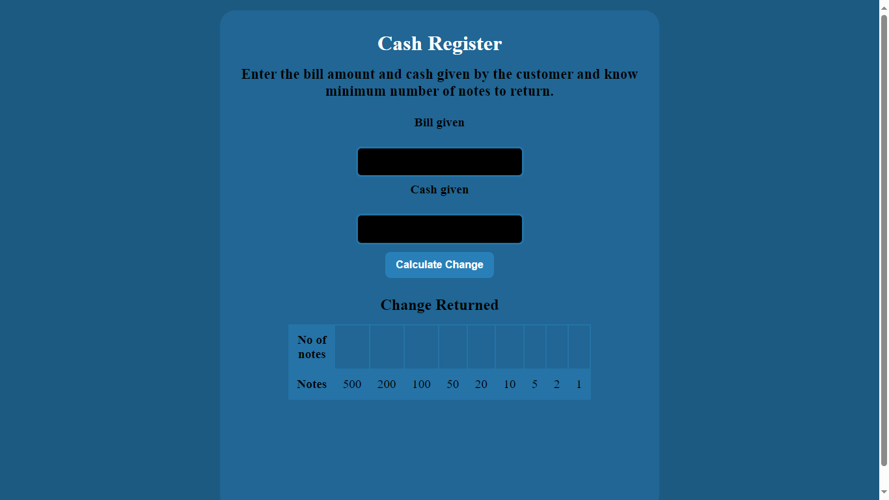
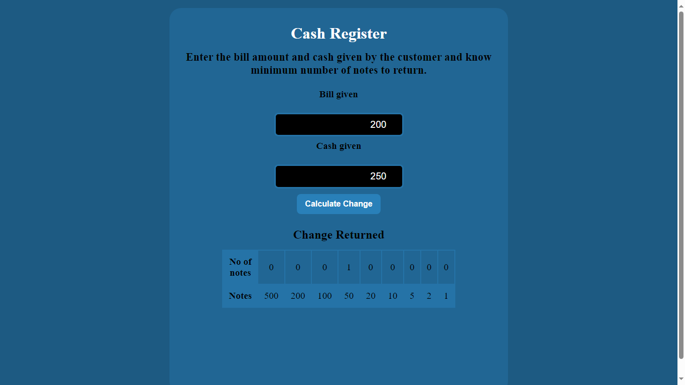

# Cash Register Manager App

 An app that calculates the change to be returned. It takes the bill amount and cash given by the customer as the input and calculates the least number of notes to be returned.

## Features

- **Input Section:** Enter the bill amount and cash given by the customer.
- **Calculate Change:** Click the "Calculate Change" button to determine the minimum number of notes to return.
- **Change Returned Table:** View a table displaying the number of notes for various denominations.

## Technologies Used

## Funny Joke 😄

If you enter an amount less than the actual bill, you might get a friendly reminder try it now !!!

## Screenshot

## Usage

1. Clone the repository: `https://github.com/Bharat-Dua/EasyChange-Tracker.git`
2. Open the `index.html` file in your preferred browser.
